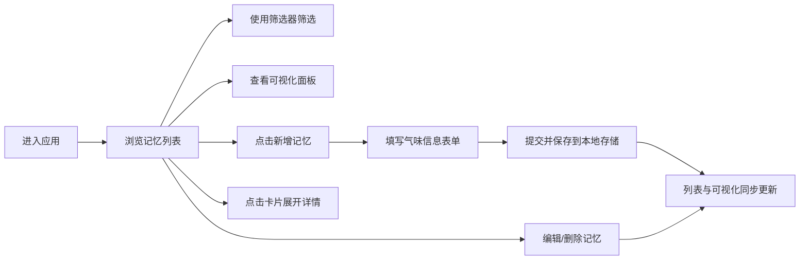

## 1. 产品概述

旧房间气味记忆库是一款个人气味记录应用，帮助用户捕捉和保存生活空间中那些难以忘怀的特殊气味记忆。用户可以记录气味的具体特征，并通过筛选和可视化面板，随时唤起那些尘封已久的感官回忆。

- 核心目标：为用户提供一个细腻、有温度的气味记忆档案库
- 目标用户：对气味敏感、喜欢记录生活细节的人群
- 产品价值：将抽象的嗅觉体验转化为可检索、可回味的数据资产

---

## 2. 核心功能

### 2.1 功能模块

1. **记忆列表主页面**：筛选栏、可视化面板、气味记忆卡片瀑布流
2. **新增/编辑记忆表单**：结构化录入气味各项属性的表单弹窗
3. **记忆详情查看**：展开式卡片查看完整记忆内容

### 2.2 页面详情

| 页面名称 | 模块名称 | 功能描述 |
|---------|---------|---------|
| 主页面 | 顶部标题区 | 品牌名、副标题说明、新增记忆按钮 |
| 主页面 | 筛选面板 | 按气味类型筛选、按季节筛选、按情绪筛选、重置按钮 |
| 主页面 | 气味强度可视化 | 强度分布柱状图、平均强度仪表盘、湿度感散点图、Top5 最强气味 |
| 主页面 | 记忆卡片列表 | 卡片网格布局、颜色联想色块、关键属性标签、编辑/删除操作 |
| 表单弹窗 | 基础信息 | 地点输入、气味来源猜测输入 |
| 表单弹窗 | 感官属性 | 强度滑块(1-10)、湿度感滑块(极干-极湿)、季节选择器、颜色联想取色器 |
| 表单弹窗 | 情感属性 | 关联记忆文本域、情绪选择器、是否想再次闻到开关 |
| 卡片展开 | 详情面板 | 完整信息展示、关联记忆全文、时间戳 |

---

## 3. 核心流程

用户进入应用后，首先浏览已有记忆卡片和可视化面板。用户可通过筛选面板按气味类型、季节或情绪过滤记忆。点击「新增记忆」按钮弹出表单，填写地点、气味来源、强度、湿度感、季节、关联记忆、颜色联想等信息后提交，新卡片立即出现在列表中，可视化面板同步更新。点击卡片可展开查看完整详情，或进行编辑、删除操作。

---

## 4. 用户界面设计

### 4.1 设计风格

**整体调性：怀旧、温暖、纸张质感**

- **主色调**：暖米白 (#F5EFE0) 作为主背景，焦赭色 (#8B5A2B) 作为主色，墨绿 (#3D5A4A) 辅助，旧纸张黄 (#E8DCC8) 点缀
- **辅助色**：淡紫灰 (#9B8AA6) 代表气味的飘渺感，砖红 (#A0522D) 用于强调按钮
- **按钮风格**：圆角矩形 (12px)，微浮雕质感，hover 时有轻微上浮 + 阴影加深
- **字体**：标题用「宋体」或「LXGW WenKai」等衬线/手写感字体；正文用系统无衬线字体保证可读性
- **布局风格**：卡片式布局，不规则错落排列，模仿档案夹/相册的拼贴感
- **图标风格**：手绘线性图标，emoji 辅助表达（🍂🌸❄️🌿）
- **质感**：纸张纹理背景、卡片阴影模拟书脊厚度、微弱噪点覆盖增加复古感

### 4.2 页面设计概述

| 页面/模块 | UI元素 | 设计描述 |
|----------|--------|---------|
| 顶部标题区 | 标题、副标题、按钮 | 大衬线字体居中，下方小字副标题，右侧悬浮式「+ 封存一段气味」按钮 |
| 筛选面板 | 三个下拉筛选器 + 重置按钮 | 横向排列，每个筛选器像抽屉标签，选中后底色变为焦赭色 |
| 可视化面板 | 四个小图表模块 | 2x2 网格布局，每个图表区域有薄边框和纸张底色，标题用手写体小字 |
| 记忆卡片 | 颜色条、地点、标签、操作按钮 | 卡片大小不一（瀑布流），左侧竖条显示颜色联想色块，底部标签展示季节/类型/强度 |
| 表单弹窗 | 分区表单、滑块、取色器 | 半透明遮罩 + 纸张质感弹窗，分三个区块用细线分隔，滑块有复古刻度线 |
| 卡片展开详情 | 完整属性、关联记忆正文 | 类似翻开日记本，关联记忆区域用稍深背景区分，左右 padding 增加阅读感 |

### 4.3 响应式

- **桌面端优先设计**（1280px 起步）：筛选器横向排列、可视化 2x2 网格、卡片 3-4 列瀑布流
- **平板端**（768px-1279px）：可视化改为纵向堆叠、卡片 2 列
- **移动端**（<768px）：筛选器堆叠、可视化单列、卡片单列、表单弹窗改为占满屏幕 90%

### 4.4 交互动效

- 页面加载：卡片错落渐入（staggered fade-in），每张延迟 50ms
- 卡片 hover：轻微上浮（translateY -4px）+ 阴影扩散，颜色条轻微变宽
- 表单弹窗：从顶部 20px 下滑淡入，背景遮罩 300ms 渐变
- 筛选切换：卡片非匹配项先淡出，再重新排列淡入
- 滑块拖拽：滑块位置有实时数值气泡提示
