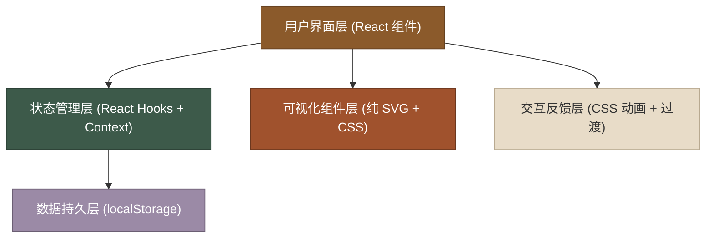
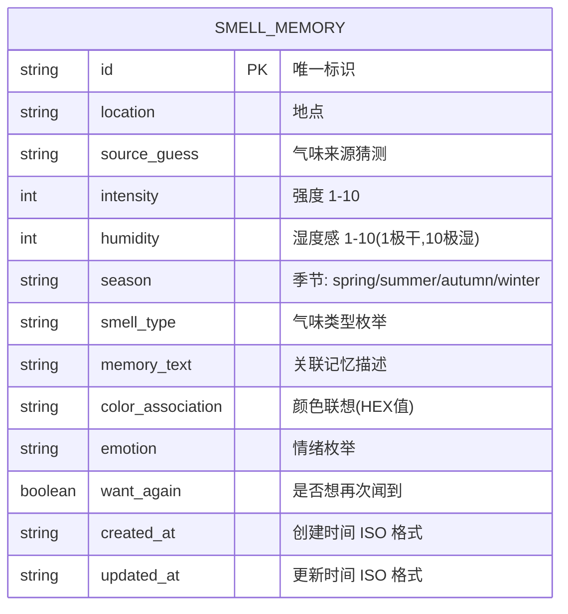

## 1. 架构设计



## 2. 技术描述

- **前端框架**：React@18 (使用 Hooks：useState、useEffect、useContext、useMemo)
- **构建工具**：Vite@5 (快速启动、HMR 热更新)
- **样式方案**：Tailwind CSS@3 + 自定义 CSS 变量 (控制主题色系)
- **数据存储**：localStorage (无后端，纯前端持久化)
- **可视化方案**：原生 SVG 绘制图表 + CSS 渐变，不引入第三方图表库
- **图标方案**：SVG 内联图标 + emoji 组合
- **字体方案**：Google Fonts 引入「Noto Serif SC」(衬线体) + 系统无衬线字体栈

## 3. 目录结构

```
zfl-4/
├── src/
│   ├── components/
│   │   ├── Header.jsx            # 顶部标题区
│   │   ├── FilterPanel.jsx       # 筛选面板
│   │   ├── VisualizationPanel.jsx # 可视化面板容器
│   │   ├── IntensityChart.jsx    # 强度分布图
│   │   ├── HumidityScatter.jsx   # 湿度感散点图
│   │   ├── AvgGauge.jsx          # 平均强度仪表盘
│   │   ├── TopList.jsx           # Top5 最强气味
│   │   ├── MemoryCard.jsx        # 记忆卡片
│   │   ├── MemoryGrid.jsx        # 卡片网格容器
│   │   ├── MemoryModal.jsx       # 新增/编辑表单弹窗
│   │   └── MemoryDetail.jsx      # 卡片展开详情
│   ├── context/
│   │   └── MemoryContext.jsx     # 全局状态 Context
│   ├── data/
│   │   └── mockData.js           # 预置的示例记忆数据
│   ├── hooks/
│   │   └── useLocalStorage.js    # localStorage 自定义 Hook
│   ├── utils/
│   │   ├── constants.js          # 常量定义(季节/类型/情绪枚举)
│   │   └── helpers.js            # 工具函数(筛选、统计计算)
│   ├── App.jsx
│   ├── main.jsx
│   └── index.css
├── index.html
├── package.json
├── vite.config.js
├── tailwind.config.js
└── postcss.config.js
```

## 4. 数据模型

### 4.1 数据模型定义 (ER 图)



### 4.2 枚举常量定义

| 枚举类型 | 可选值 |
|---------|-------|
| 季节 (season) | spring (春🌸), summer (夏☀️), autumn (秋🍂), winter (冬❄️) |
| 气味类型 (smell_type) | woody (木质), floral (花香), fruity (果香), earthy (泥土), spicy (辛香), sweet (甜香), musty (霉味), fresh (清新), burnt (焦味), other (其他) |
| 情绪 (emotion) | warm (温暖), nostalgic (怀旧), peaceful (宁静), melancholy (忧郁), joyful (愉悦), uncomfortable (不适), surprising (惊喜) |

## 5. 路由定义

本应用为单页应用 (SPA)，无路由切换，所有功能在同一页面通过组件状态控制：

| 组件状态 | 触发条件 | 说明 |
|---------|---------|-----|
| 模态框显示 | 点击「新增」或「编辑」按钮 | MemoryModal 组件挂载 |
| 卡片展开 | 点击卡片主体区域 | MemoryDetail 展开显示 |
| 筛选激活 | 选择筛选下拉项 | MemoryGrid 过滤渲染 |

## 6. 核心组件 Props 定义

### MemoryCard 组件

```typescript
interface MemoryCardProps {
  memory: SmellMemory;
  onEdit: (id: string) => void;
  onDelete: (id: string) => void;
  onExpand: (id: string) => void;
  isExpanded: boolean;
  index: number; // 用于动画延迟
}
```

### MemoryModal 组件

```typescript
interface MemoryModalProps {
  isOpen: boolean;
  onClose: () => void;
  onSubmit: (data: Omit<SmellMemory, 'id' | 'created_at' | 'updated_at'>) => void;
  editingData?: SmellMemory | null;
}
```

### FilterPanel 组件

```typescript
interface FilterPanelProps {
  filters: { smellType: string; season: string; emotion: string };
  onFilterChange: (key: string, value: string) => void;
  onReset: () => void;
}
```
